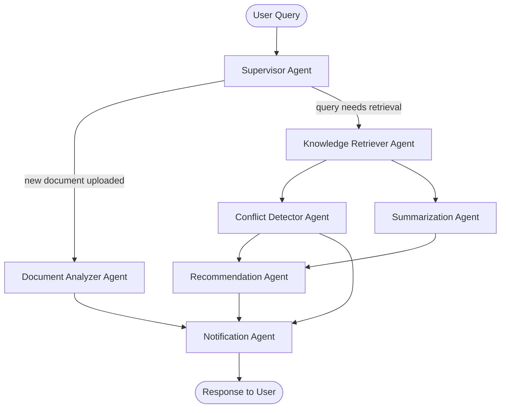

# AI Agent Workflow Diagram

## 7 LangGraph Agents

## Agent Responsibilities

| Agent | Input | Output | Tools | Memory |
|---|---|---|---|---|
| Supervisor Agent | User query, conversation state | Routing decision to sub-agents | Router logic | Conversation history (SQLite) |
| Document Analyzer Agent | Raw uploaded document (any supported format) | Extracted entities, document type, structure | Multi-format loader (PDF/DOCX/PPTX/XLSX/EML), OCR, NER | None (stateless per document) |
| Knowledge Retriever Agent | Query text, customer_id | Ranked chunks with citations | ChromaDB retriever | Short-term (current query context) |
| Conflict Detector Agent | Retrieved chunks from 2+ documents | Conflict list with severity | LLM comparison prompt | None (stateless per analysis) |
| Summarization Agent | Retrieved chunks / conversation | Concise summary text | LLM summarization prompt | Conversation context |
| Recommendation Agent | Summary + conflicts | Recommendation + confidence score | LLM reasoning prompt | Conversation context |
| Notification Agent | Any agent completion event | Notification record | Notification service | None |

## Error Handling
- Each agent wraps LLM calls in try/except with retry (exponential backoff, max 3 attempts).
- On irrecoverable failure, the Supervisor Agent returns a graceful fallback message and logs the error to `audit_logs`.
- Conflict Detector and Recommendation Agents require a minimum confidence threshold (0.6) before surfacing output; below threshold, output is withheld and flagged for manual review (BR-5).
