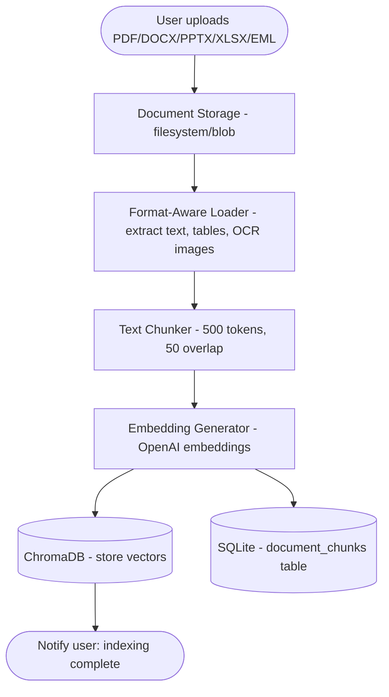
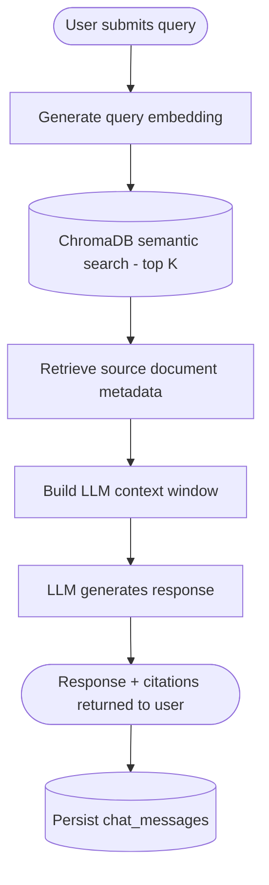

# Data Flow Diagram

## 1. Document Ingestion Flow

## 2. Query & Retrieval Flow

## Data Elements at Each Stage

| Stage | Input | Output |
|---|---|---|
| Upload | Raw file bytes (PDF/DOCX/PPTX/XLSX/EML) | Stored file + `document` row (status=uploaded) |
| Extraction | File path + file_type | Raw text string (text, table rows flattened to text, OCR'd image text) |
| Chunking | Raw text | List of text chunks (500 tokens, 50 overlap) |
| Embedding | Text chunks | Vector embeddings (1536-dim) |
| Storage | Vectors + chunk metadata | ChromaDB collection entries + `document_chunks` rows |
| Query embedding | User query string | Query vector |
| Semantic search | Query vector | Top-K chunk matches with similarity scores |
| Context assembly | Matched chunks | Formatted LLM prompt context |
| Generation | Prompt + context | Natural language answer + source list |
| Persistence | Answer + sources | `chat_messages` row |
