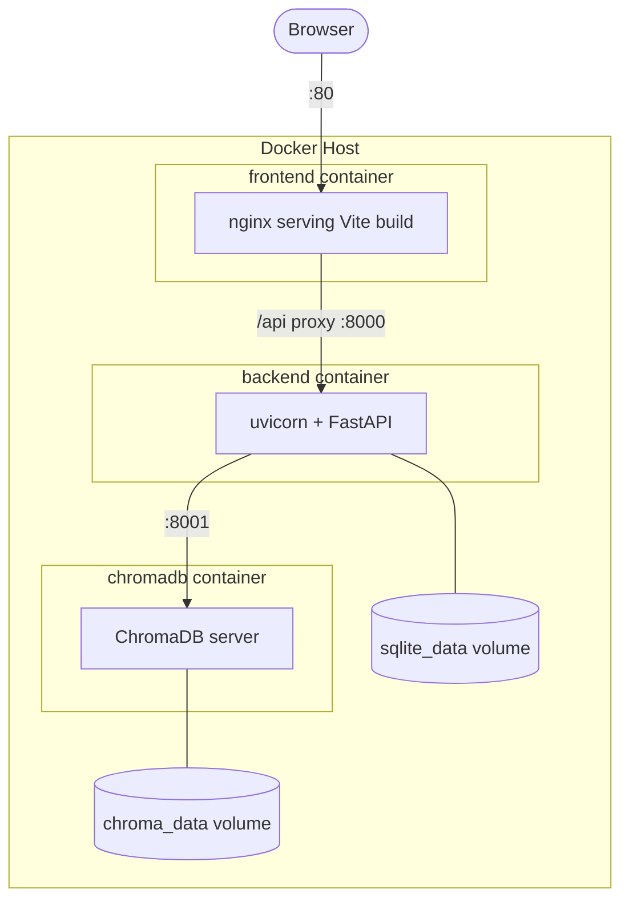

# Deployment Architecture Diagram

## docker-compose Service Map

| Service | Image/Build | Ports | Volumes | Depends On |
|---|---|---|---|---|
| frontend | `./frontend` (multi-stage Dockerfile) | `80:80` | — | backend |
| backend | `./backend` (Dockerfile) | `8000:8000` | `sqlite_data:/app/data` | chromadb |
| chromadb | `chromadb/chroma` | `8001:8000` | `chroma_data:/chroma/chroma` | — |

## Environment Variables (per service)

| Variable | Service | Purpose |
|---|---|---|
| `OPENAI_API_KEY` | backend | LLM/embedding API access |
| `DATABASE_URL` | backend | SQLite connection string |
| `CHROMA_HOST` / `CHROMA_PORT` | backend | ChromaDB connection |
| `JWT_SECRET_KEY` | backend | Token signing secret |
| `VITE_API_BASE_URL` | frontend | Backend API base URL |

## Network
- All services share a Docker bridge network `app-network`.
- Only `frontend` port 80 is exposed externally in production; `backend` and `chromadb` are internal-only behind the frontend/reverse proxy.
