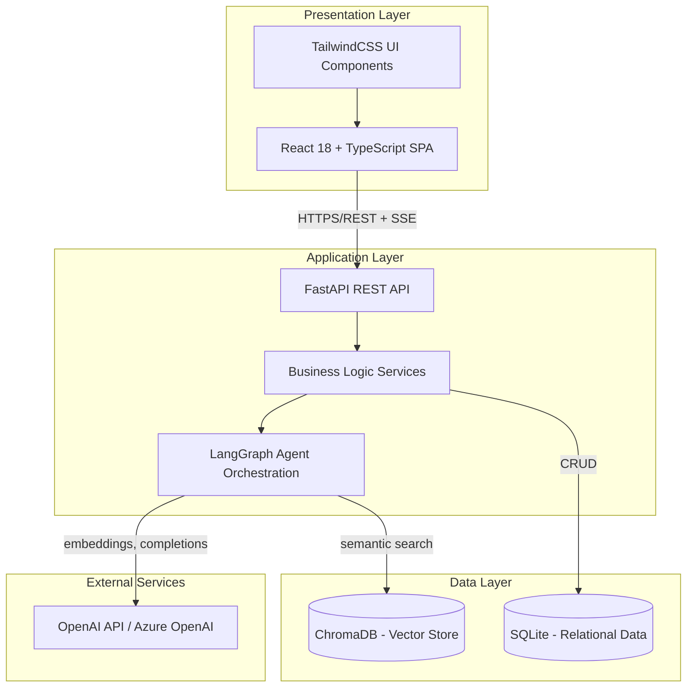

# Logical Architecture Diagram

**Layer responsibilities**

| Layer | Responsibility |
|---|---|
| Presentation | Renders UI, manages client state, streams chat responses to the user |
| Application | Exposes REST/SSE endpoints, enforces business rules, orchestrates the 7 LangGraph agents |
| Data | Persists relational entities (SQLite) and vector embeddings (ChromaDB) |
| External Services | Provides LLM completions and embedding generation via OpenAI/Azure OpenAI |
