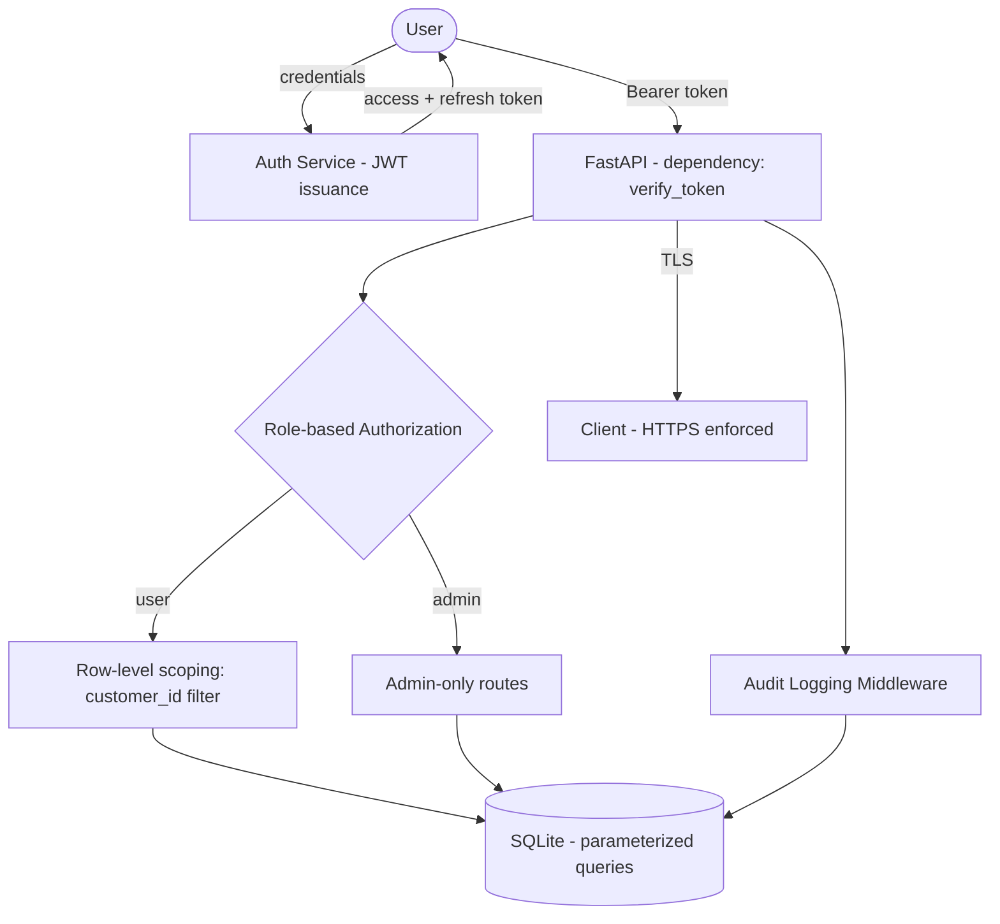

# Security Architecture Diagram

## Controls

| Control | Implementation |
|---|---|
| Authentication | JWT access token (15 min expiry) + refresh token (7 days), issued on `/api/auth/login` |
| Authorization | Role field (`user`/`admin`) on `customers`; route-level dependency checks role and ownership |
| Data encryption in transit | HTTPS/TLS termination at reverse proxy |
| Data encryption at rest | SQLCipher-backed SQLite (optional), OS-level disk encryption for ChromaDB volume |
| Audit logging | Middleware logs every mutating request (actor, action, entity, IP, timestamp) to `audit_logs` |
| API security | Rate limiting (per-IP token bucket), Pydantic input validation, request size limits |
| Database security | SQLAlchemy parameterized queries only; no raw string interpolation |
| Prompt injection defense | `prompt_injection_filter.py` sanitizes user input before it reaches the LLM context |
| Secrets management | All API keys/secrets loaded from environment variables via `.env`, never committed |
