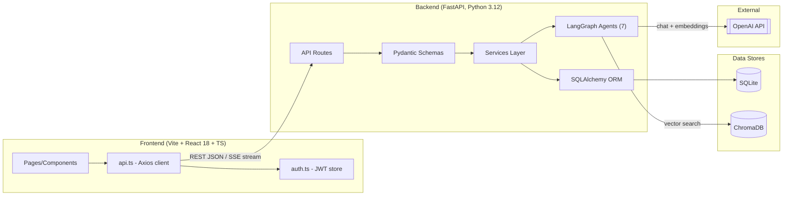

# Technical Architecture Diagram

## Component Inventory

| Component | Technology | Responsibility |
|---|---|---|
| Frontend SPA | React 18, TypeScript, Vite, TailwindCSS | UI rendering, client-side routing, state management |
| API Gateway | FastAPI | Request validation, auth, routing to services |
| Schema Layer | Pydantic v2 | Request/response validation and serialization |
| Service Layer | Python modules | Business logic: document, chat, RAG services |
| Agent Layer | LangGraph + LangChain | 7 autonomous agents for retrieval, conflict detection, summarization |
| ORM | SQLAlchemy | Relational data access to SQLite |
| Vector Store | ChromaDB | Embedding storage and similarity search |
| LLM Provider | OpenAI / Azure OpenAI | Chat completions, text embeddings |

## Message Flow (Chat Query Example)
1. Frontend sends `POST /api/chat` with `conversation_id` + `message`.
2. FastAPI route validates via Pydantic schema, authenticates JWT.
3. `chat_service.py` loads conversation context from SQLite.
4. Supervisor Agent invoked with query + context.
5. Supervisor routes to Knowledge Retriever Agent → queries ChromaDB.
6. Retrieved chunks + query passed to Summarization/Recommendation Agents as needed.
7. Response streamed back to frontend via Server-Sent Events.
8. Final message + sources persisted to `chat_messages` table.
