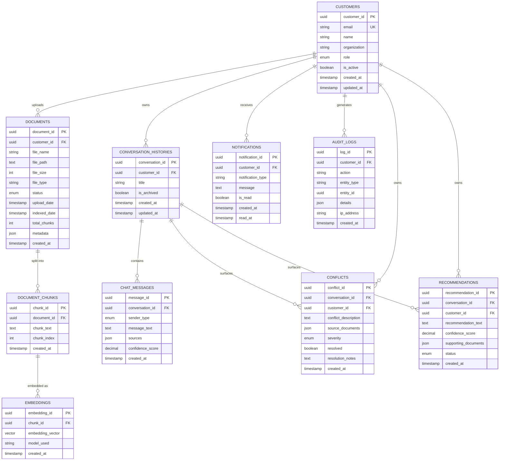

# Entity-Relationship Diagram

## Cardinality Summary

| Relationship | Cardinality |
|---|---|
| Customer → Document | 1 : N |
| Customer → ConversationHistory | 1 : N |
| Customer → Notification | 1 : N |
| Customer → AuditLog | 1 : N |
| Customer → Conflict | 1 : N |
| Customer → Recommendation | 1 : N |
| Document → DocumentChunk | 1 : N |
| DocumentChunk → Embedding | 1 : 1 |
| ConversationHistory → ChatMessage | 1 : N |
| ConversationHistory → Conflict | 1 : N |
| ConversationHistory → Recommendation | 1 : N |
